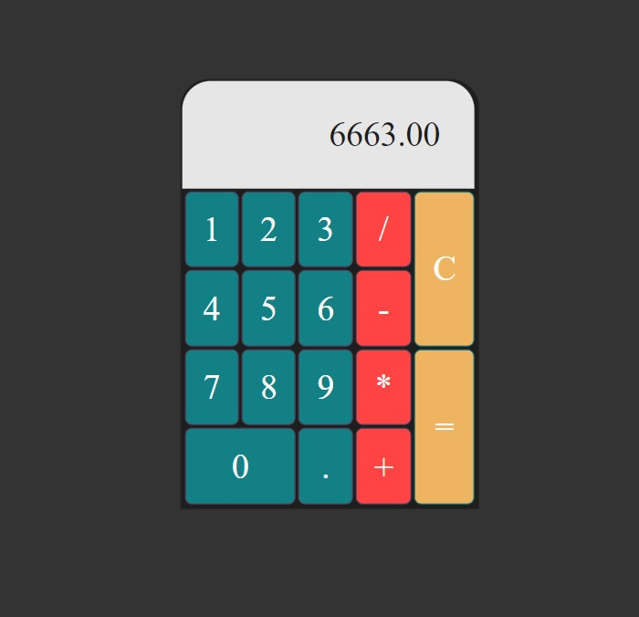

# calculator
Pure html, css, js calculator example

A simple functional calculator is implemented using HTML, CSS, and JS in this project.

There are 3 main parts in this calculator.

1. [Result part](#result-part)
2. [Keys](#keys)
3. [Operators](#operators)

### Result Part

Result part shows only the result of the operation and does not show any mathematical operation signs. The result will be reset, when the user click on "C" symbol. Otherwise, the result will stay unchanged no matter how many times user click on operators.

### Keys

The keys include only numbers from 0-9 and "." symbol for decimal numbers. The background color will be changed on hover and on click the number will be added to the end of the result part as a string.

### Operators

The operators are mathematical symbols "+, -, *, /, =" and "C" symbol to reset the result. User can use these symbols continuously and calculate cascaded calculations.